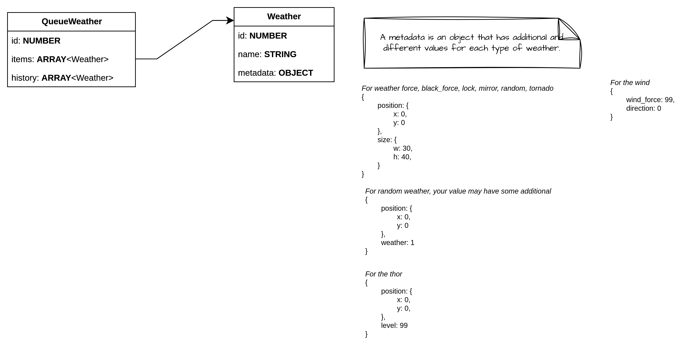
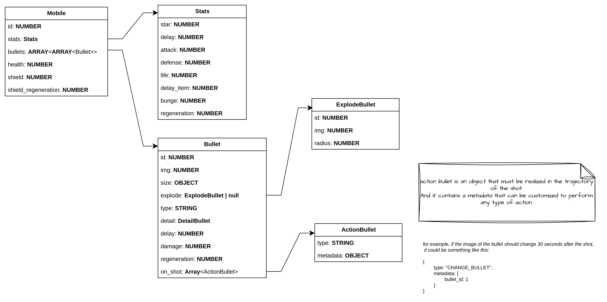

# Game logic

## Diagram

The drawings or diagrams shown in this section can be modified through the following link [Draw](https://app.diagrams.net/#G1mIfIJ19J7oW2Iw8vo3GrpQjWOFiF0zVn#%7B%22pageId%22%3A%22kow-iseRG58Xen-pIDAg%22%7D)

## Weather



## Bullets
the logic of the bullet may consist of the following diagram
> **Why this logic?**
> The idea is to have a better bale structure to easily manage its lifecycle.



| First Header  | Second Header | Código |
| ------------- | ------------- | ------ |
| Content Cell  | Content Cell  | ``` { name: "ga" } ``` |
| Content Cell  | Content Cell  | ``` { name: "ga" } ``` |